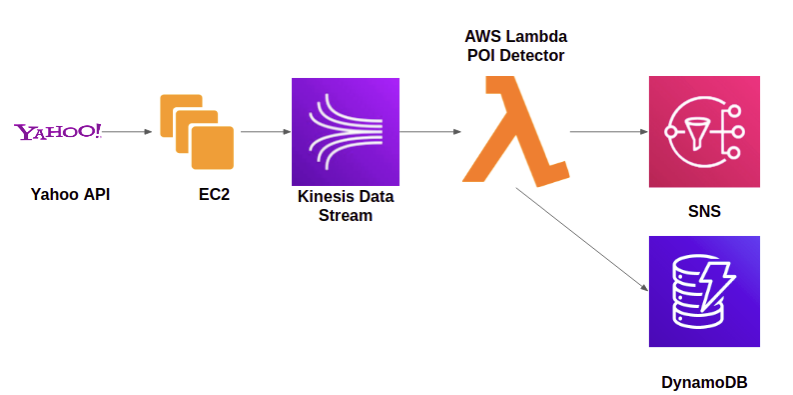
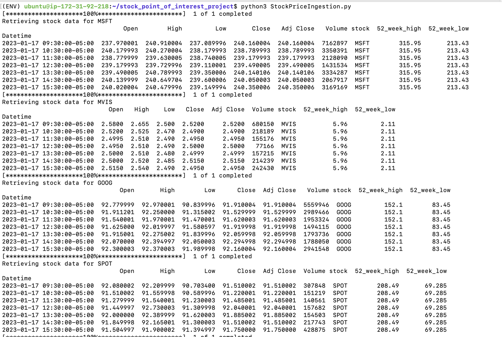
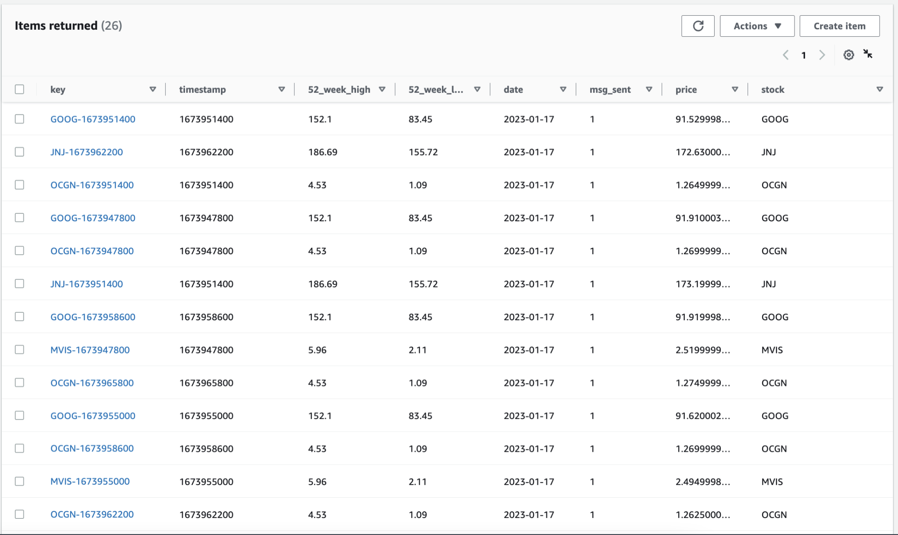
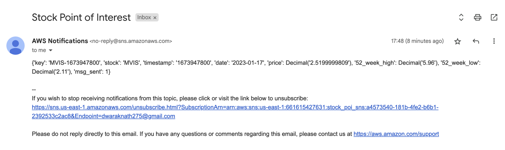

# Stock analysis

We want to build a system that streams stock pricing information for various stocks at different times and then notifies the stakeholders when the values cross specific points of interest (POIs).

We’ll use the Yahoo Finance APIs to query the running price of stocks and general information like 52-week high/low values.

Yahoo Finance API - It provides functions to download historical market data from Yahoo! finance. While this functionality in production would generally run on a paid api that provides real-time stock price data, we’ll mimic it by using historical data for an older time period and streaming it over kinesis.
Link - https://pypi.org/project/yfinance/
Please go through this link to understand how to access different stocks data and information.
You need to pull the data for the following 10 stocks - 
MSFT, MVIS, GOOG, SPOT, INO, OCGN, ABML, RLLCF, JNJ, PSFE
You can check the details of these stocks here - https://finance.yahoo.com/lookup/

## Architecture diagram

## Architecture Implementation	
1. Create EC2 Instance
2. Run Python Script to Pull data from Yahoo Stock API 
3. Use boto3 and kinesis client to Push data from EC2 to Kinesis Stream
4. Configure SNS to publish the notification through mail, Configure DynamoDB to store the alert data. 
5. Write a Lambda function to detect the POIs and to Push the Notification to SNS
6. Use the same Lambda Function to push data to DynamoDB 

## Steps to implement the project
### Create EC2 Instance
1. Navigate to EC2 Services from AWS management console page
2. Choose `instances` available in the left pane. 
3. Click on `launch instances`
4. Choose  the free tier for `Amazon Linux`
5. Choose instance type as t2.micro 
6. Configure instance details keep all the option as be default
7. Keep default storage option and provide optional tag details
8. Create a new security group for the instance.(Configure SSH option) Make it more secure by choosing source as MyIP. 
9. Click on the launch button, It will prompt you to create a new key pair. Provide the name and download the key for login purposes.

### Run Python Script to Pull data from Yahoo Stock API
1. Login to the EC2 instance using the key pair downloaded in the previous step.
2. Clone the repository using the command `git clone
3. Navigate to the project directory using the command `cd stock-analysis`
4. Install the required packages using the command `pip3 install -r requirements.txt`
5. Run the python script using the command `python3 StockPriceIngestion.py`
6. You can alternatively run `sh create_python_env.sh` to create a virtual environment and install the required packages. Then run the python script using the command `python3 StockPriceIngestion.py`.

Example:

### Use boto3 and kinesis client to Push data from EC2 to Kinesis Stream

1. Go to the Kinesis stream services. 
2. Configure the data stream to accept the data pushed by the script. 
3. Create and attach appropriate policy and the IAM role to push the data to Kinesis stream from EC2. (helpful link - https://docs.amazonaws.cn/en_us/streams/latest/dev/tutorial-stock-data-kplkcl-iam.html)
4. Edit the name of the created input kinesis stream inside the python script as required.
5. You should craft individual data records with information about the stockid, price, price timestamp, 52WeekHigh and 52WeekLow values and push them individually on the Kinesis stream.

### Configure SNS to publish the notification through mail, Configure DynamoDB to store the alert data.

1. Create a new SNS topic and configure it to send the notification through mail.
    a. Go to SNS services and click on create topic.
    b. Provide the topic name and display name.
    c. Click on create topic.
    d. Click on create subscription.
    e. Choose the protocol as email and provide the email id.
    f. Click on create subscription.
    g. You will receive a confirmation mail. Confirm the subscription.
2. Create a new DynamoDB table to store the alert data.
    a. Go to DynamoDB services and click on create table.
    b. Provide the table name by providing partition key and sort key.
    c. Click on create table.

### Write a Lambda function to detect the POIs and to Push the Notification to SNS
1. Choose lambda services and create a lambda handler. Set it up to act as a consumer to your Kinesis data stream (https://docs.aws.amazon.com/lambda/latest/dg/with-kinesis.html)
2. A particular price is a POI (point of interest) if it’s either >= 80% of 52WeekHigh or <= 120% of 52WeekLow. If this event happens for a stock, then that data record should be notified via SNS and stored in a DynamoDB alert table as well.
3. Please note that you may not find any alerts created due to the price values of the stock on that particular day, compared to the 52WeekHigh/Low values. You are free to change the percentages in point 2 to accomplish an alert trigger.
4. For each stock, if there is already an alert raised on a particular day, then any further alerts on that day should be skipped. Please think about the dynamodb table structure accordingly, to make this easier to query and accomplish.

Refer to lambda_function.py for the lambda function code.

### Final Output
#### DynamoDB Table Sample Data:

#### SNS Notification:

